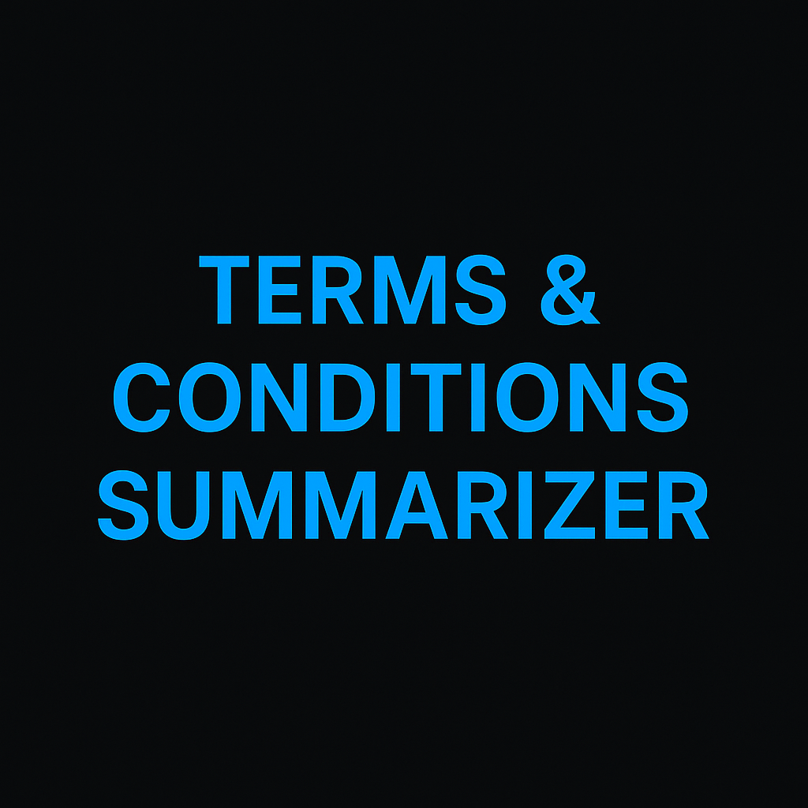

# 📝 Terms & Conditions Summarizer (Rule-Based)

A lightweight, no-API, rule-based Terms & Conditions summarizer that works on **any webpage**.  
No OpenAI, no HuggingFace, no GPU, no rate limits. Pure Python.

<p align="center">
  
</p>

---

## ⭐ Features

✔ No API keys required  
✔ Works on *any* T&C webpage  
✔ Rule-based → no ML downloads, no heavy models  
✔ Extracts:
- Data collection rules  
- Privacy clauses  
- Third-party sharing  
- Payments/Subscriptions  
- Cancellations & Refunds  
- Liability statements  
- User responsibilities  

✔ Works offline (if you paste HTML text)  
✔ Clean and readable outputs

---

## 📦 Installation

```bash
git clone https://github.com/NA-V10/terms-summarizer.git
cd terms-summarizer
pip install -r requirements.txt
```

## Usage

```bash
python terms_agent.py
```

To summarize another URL:

```bash
from terms_agent import terms_agent
print(terms_agent("https://example.com/terms"))
```

## Requirements

-Install requirements:

```bash
pip install -r requirements.txt
```

🧠 How It Works

-Fetch webpage
-Clean HTML → plain text
-Rule-based extraction for:
-legal keywords
-obligations
-data practices
-Build summary + key points
-No machine learning needed.

📁 Project Structure

```code
terms-summarizer/
│
├── terms_agent.py        # main agent logic
├── requirements.txt      # dependencies
├── README.md             # documentation
├── banner.png            
```

🤝 Contributing

PRs welcome!
Feel free to open issues or suggest improvements.